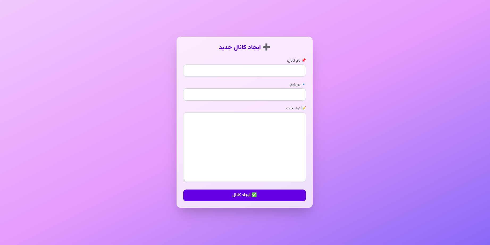
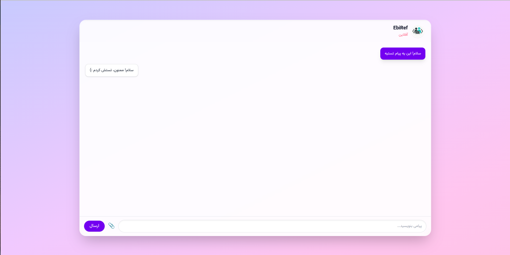
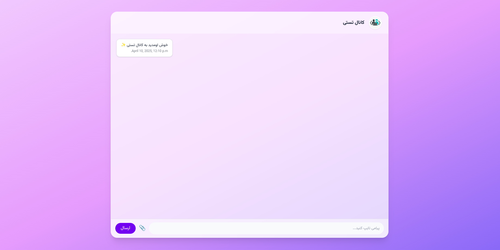

* https://github.com/Artyomza312/chat_repo
# Channel Chat App

## Features

- Real-time messaging using WebSockets
- Create, join, and manage chat channels
- Send and receive text, images, videos, voice messages, and files
- Responsive user interface with RTL support
- Profile picture zoom on click
- Channel owner tools and options


## Screenshots

  
  



## Technologies Used

- Python 3.12
- Django
- Django Channels
- ASGI
- WebSocket
- Tailwind CSS
- HTML, JavaScript

## You may need during installation

### 1. Clone the Repository

```bash
git clone https://github.com/yourusername/phusion-chat.git
cd phusion-chat

```

### 2. Load Sample Test Data (Optional)
```bash
python3 manage.py loaddata fixtures/sample_data.json

uvicorn your_project_name.asgi:application --host 0.0.0.0 --port 8000 --reload
